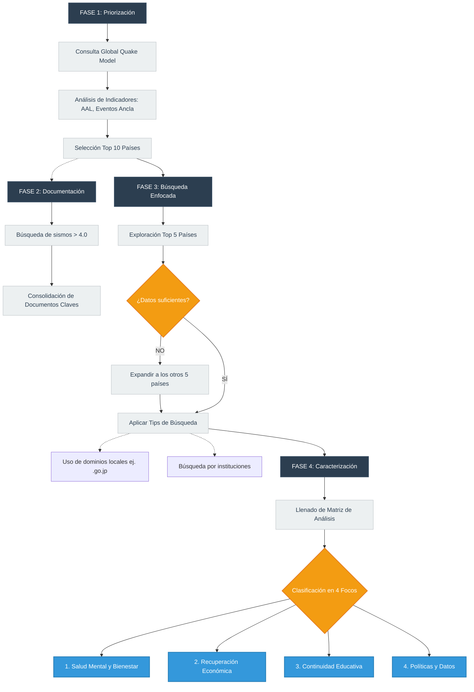

# Propuesta metodológica: Vigilancia estratégica de iniciativas Post-Terremoto

A continuación, se presenta la ruta de trabajo estructurada para identificar, filtrar y caracterizar las mejores prácticas e iniciativas implementadas a nivel global tras eventos sísmicos.

## Mapa de Ruta

---

## Detalle operativo por fases

### Fase 1: Perfilamiento y priorización de países
**Objetivo:** Definir y justificar cuantitativamente una muestra (Top 10) de los países con mayor riesgo y exposición sísmica a nivel global para enfocar la búsqueda.
* **Herramienta de análisis:** Exploración de datos a través del mapa interactivo [Global Seismic Risk Map (Global Quake Model)](https://www.globalquakemodel.org/product/global-seismic-risk-map).
* **Extracción de variables clave:** De cada país se extraen indicadores sociales (Población, PIB, Índice Gini), **Eventos ancla** (terremotos históricos de gran magnitud) y las prefecturas/ciudades con mayor nivel de pérdida.
* **Entregable (Ficha 1 - Contexto de amenaza y exposición):** Documento que consolida el Top 10 de países priorizados. La inclusión de cada país se justifica estrictamente mediante indicadores cuantitativos como la **Pérdida Anual Promedio (AAL)** 

### Fase 2: Soporte documental (Marco de referencia)
**Objetivo:** Establecer la base teórica e histórica que respalde la investigación.
* **Metodología de rastreo:** Búsquedas estructuradas y desestructuradas en español e inglés sobre eventos sísmicos con magnitudes superiores a 4.0.
* **Entregable (Ficha 2 - Documentos claves):** Consolidado de literatura y reportes oficiales que servirán como soporte documental de la vigilancia.

### Fase 3: Búsqueda enfocada de iniciativas
**Objetivo:** Rastrear iniciativas gubernamentales e institucionales de acceso gratuito en la web.
* **Despliegue inicial:** La exploración arranca en los **primeros 5 países** del Top 10. Si no se halla información suficientemente documentada o accesible para caracterizar las prácticas, se procede con una reorientación estratégica hacia los 5 países restantes de la muestra.
* **Tips de búsqueda:**
  * **Filtros por dominio local:** Modificación de la ubicación en navegadores y uso restrictivo de dominios específicos por país (Ej. `site:.go.jp` para rastrear ministerios en Japón).
  * **Búsqueda por hitos y entidades:** Evitar términos genéricos que arrojan ruido (ej. *"buenas prácticas de salud mental en Japón"*). En su lugar, rastrear instituciones con nombre propio creadas tras desastres específicos (ej. *"qué se creó después de Kobe 1995"*).
  * **Geolocalización del desastre:** Emplear los nombres exactos de las ciudades o prefecturas con mayores afectaciones (identificadas en la Fase 1) para hallar programas de recuperación locales.

### Fase 4: Caracterización y extracción de datos
**Objetivo:** Sistematizar las iniciativas vigentes (de los últimos 40 años) extraídas de portales gubernamentales, redes sociales oficiales y canales de noticas locales.
* **Entregable (Ficha 3 - Matriz de caracterización):** Instrumento central de la vigilancia donde se desglosa cada iniciativa utilizando las siguientes unidades de análisis: *País, Región/Ciudad, Evento sísmico/Año, Nombre de la iniciativa, Entidad responsable, Tipo de entidad, Descripción, Población objetivo, Cobertura reportada, Resultado esperado y URLs de soporte*.
* **Clasificación por focos estratégicos:** Cada iniciativa documentada se categoriza obligatoriamente en uno de los 4 ejes definidos:
  1. **Salud mental, bienestar humano y animal**
  2. **Recuperación económica empresarial.**
  3. **Continuidad educativa y educación en gestión del riesgo.**
  4. **Políticas públicas y datos para futuras emergencias.**
